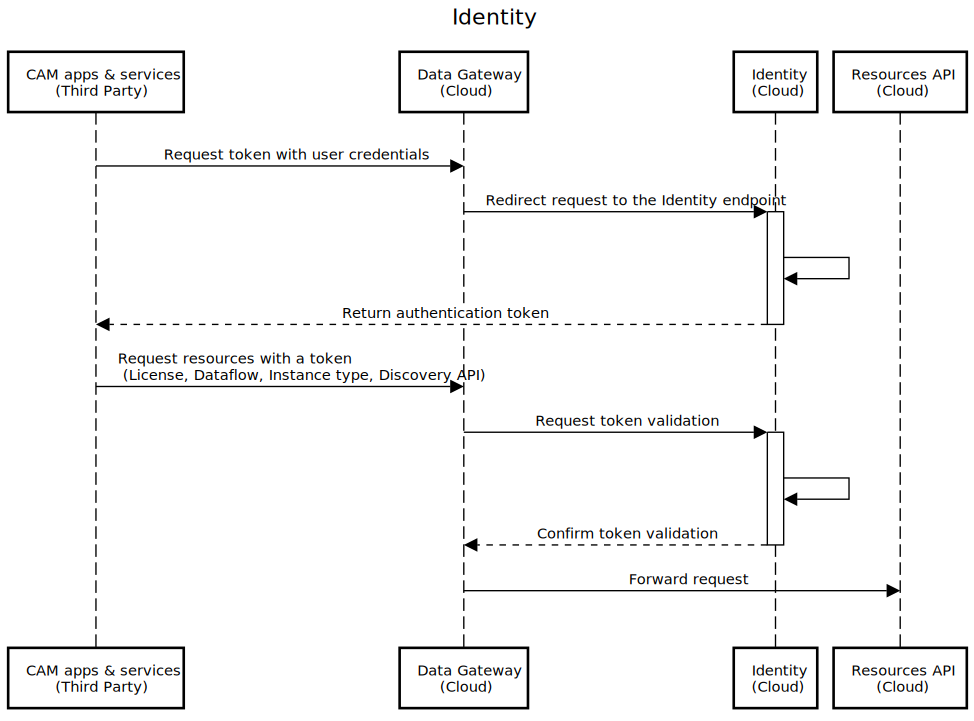
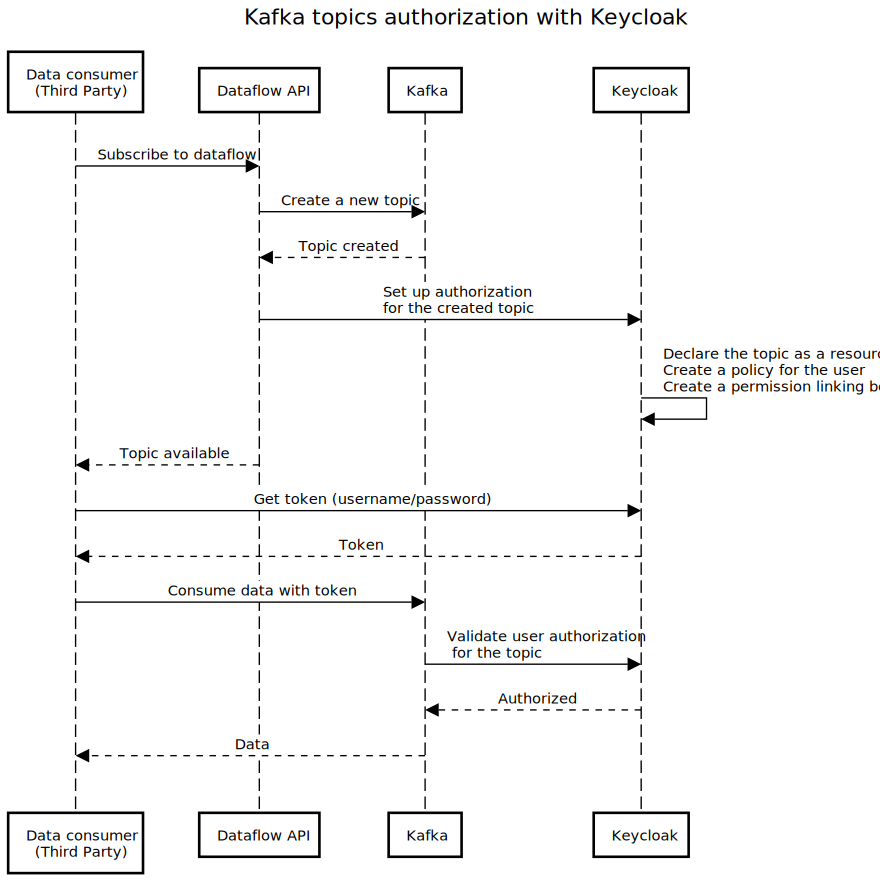

# Identity

This repository hosts the code and technical resources regarding the Identity module of the 5GMETA platform:
- The identity manager based on Keycloak
- The user information manager based on Spring Boot

## Identity manager

The identity manager serves as the platform’s centralized security service for users’ authentication and authorization. It allows the implementation of a permission policy, granting or denying access to specific services.

The following sequence diagram illustrates how the identity manager communicates with the Gateway module to protect the resources APIs.



The identity manager provides an implementation of 0Auth 2.0 and OpenID Connect using Keycloak.

The official documentation of Keycloak is available [here](https://www.keycloak.org/documentation).

### Prerequisites

- Java 8 JRE or Java 11 JRE
- zip or gzip and tar
- At least 512M of RAM
- At least 1G of diskspace
- A shared external database like PostgreSQL, MySQL, Oracle, etc. Keycloak requires an external shared database if you want to run in a cluster. Please see the database configuration section of this guide for more information.
- Network multicast support on your machine if you want to run in a cluster. Keycloak can be clustered without multicast, but this requires a bunch of configuration changes. Please see the clustering section of this guide for more information.
- On Linux, it is recommended to use /dev/urandom as a source of random data to prevent Keycloak hanging due to lack of available entropy, unless /dev/random usage is mandated by your security policy. To achieve that on Oracle JDK 8 and OpenJDK 8, set the java.security.egd system property on startup to file:/dev/urandom.

In this deployment, PostgreSQL is used in place of the default data storage. Thus PostgreSQL uses the available resources on the same host.

### Clients

Clients are necessary for the third-party applications to interact with Keycloak in order to access the protected resources. Libraries are available in the most of the common development environments.

#### Android

[AppAuth](https://openid.github.io/AppAuth-Android) is a supported client SDK which enable Android APPs to communicate with the Identity Manager ([Keycloak](https://www.keycloak.org/)). It supports both [Native Apps best practices](https://datatracker.ietf.org/doc/html/rfc8252) and [OpenID Connect](http://openid.net/connect/) providers.

#### Javascript

Keycloak provide a client-side JavaScript adapter to transform WP3 partners Front-End application to Relying Parties and be able to communicate with Identity Manager System.
Following good practices that propose to retrieve the adapter or library directly from keycloak server, we’ll provide the adapter and put it on Git *keycloak.js*.
In order to use the JavaScript adapter we’ll need first to create a client for your application in the Identity Manager administration console, and to do so we’ll need a **Root URL**, **Redirect URIs** and **Web Origins**.
The Access of Client will be defined as public, because there’s no secure way to store client credentials in a client-side application (*Client_ID, Client_Secret*).
Once the client is created, we’ll be able to produce a configuration file *keycloak.json*.
The configuration file will need to be hosted at the web server of the application in the same location as the HTML pages.
Using the adapter *Keycloak.js* and the configuration file *keycloak.json* you’ll be able to configure your RP.
The following example shows how to initialize the JavaScript adapter:

```html
<head>
    <script src="keycloak.js"></script>
    <script>
        var keycloak = Keycloak();
        keycloak.init().success(function(authenticated) {
            alert(authenticated ? 'authenticated' : 'not authenticated');
        }).error(function() {
            alert('failed to initialize');
        });
    </script>
</head>
```

If the *keycloak.json* file is in a different location you can specify it.
By default to authenticate you need to call the login function. However, there are two options available to make the adapter automatically authenticate. You can pass **login-required** or **check-sso** to the init function. login-required will authenticate the client if the user is logged-in to Keycloak or display the login page if not. check-sso will only authenticate the client if the user is already logged-in, if the user is not logged-in the browser will be redirected back to the application and remain unauthenticated.

To enable **login-required** set **onLoad** to **login-required** and pass to the init methode :
```javascript
var
keycloak.init({ onLoad: 'login-required' });
```

After the user is authenticated the application can make RESTful request secured by Keycloak by including the bearer token in the Authorization header.

#### GO

For more details see this documentation:
https://github.com/coreos/go-oidc

#### Python
For more on this approach please refer to:
https://github.com/OpenIDC/pyoidc

### APISIX integration

The following resources are available regarding the integration of the Gateway module (APISIX) and Keycloak:
- https://apisix.apache.org/blog/2021/12/10/integrate-keycloak-auth-in-apisix/
- https://apisix.apache.org/docs/apisix/plugins/authz-keycloak/

### Kafka topics authorization

In order to allow the authorization management on Kafka topics within the frame of 5GMETA, the following initialization is necessary:
- Create a dedicated Kafka *client*
- Import the necessary [authorization *scopes*](https://github.com/strimzi/strimzi-kafka-oauth/blob/main/oauth-keycloak-authorizer/etc/authorization-scopes.json)
- For the producers:
    - Create a producer *client*
    - Create a *resource* representing all topics
    - Provide the client ID and secret to the authorized data producers
- For the consumers:
    - Create a public *client*
    - Create a consumer *user group*, let's name `consumer_group`
    - Create a Kafka group *resource*, let's name `kafka_consumer_group`
    - Authorize `consumer_group` to access `kafka_consumer_group`
    - Use the Dataflow API version with authorization feature to automate the creation of the necessary authorization configuration for each created topic
 
The following sequence diagram illustrates the interaction between Keycloak, Kafka and the dataflow API.



### Deployment

Charts are provided in the [Helm charts repository](https://github.com/5gmeta/helmcharts) with:
- PostreSQL as database
- A prepopulated realm export

### Administration API

The administration API of Keycloak can be used for specific needs as described in the [official documentation](https://www.keycloak.org/docs-api/22.0.1/rest-api/index.html)

## User information manager

The user information manager allows the management of the non-Keycloak-related information in the user profile corresponding to the user business information i.e.
- The user postal address
    - Street number
    - Street name
    - City
    - Postal code
- The preferred license
    - Type (profit or non-profit)
    - Geolimit (local or city or country or global)

The implementation is based on Spring Boot allowing CRUD operations on the user information database through an API at the `/user-information-info` endpoint.
- `/address` for the user postal address management
- `/preferredLicense` for the preferred license management

## Authors

- Quentin Wephre
- [Djibrilla Amadou Kountche](https://github.com/dakountche)
- Martin Jombe Moukouri
- Kamel Khenessi
- Mandimby Ranaivo R.
- Contact: 5gmeta@akkodis.com 

## License

Copyright : Copyright 2023 AKKODIS

License : EUPL 1.2 ([https://eupl.eu/1.2/en/](https://eupl.eu/1.2/en/))

The European Union Public Licence (EUPL) is a copyleft free/open source software license created on the initiative of and approved by the European Commission in 23 official languages of the European Union.

Licensed under the EUPL License, Version 1.2 (the "License"); you may not use this file except in compliance with the License. You may obtain a copy of the License at [https://eupl.eu/1.2/en/](https://eupl.eu/1.2/en/)

Unless required by applicable law or agreed to in writing, software distributed under the License is distributed on an "AS IS" BASIS, WITHOUT WARRANTIES OR CONDITIONS OF ANY KIND, either express or implied. See the License for the specific language governing permissions and limitations under the License.
